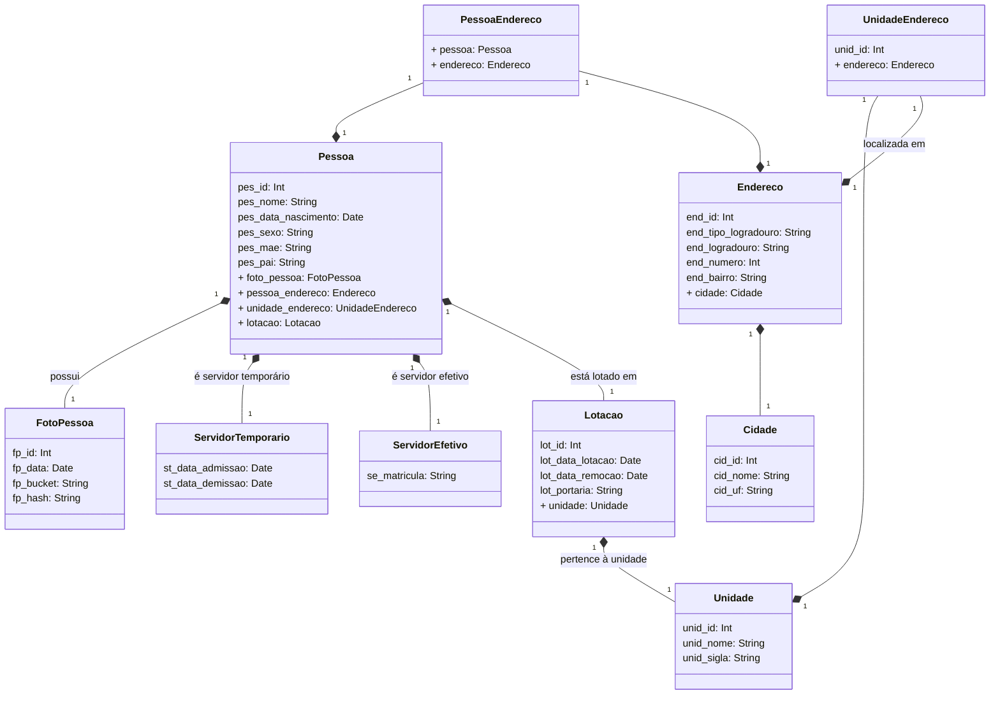

# vinnypc-apirest-santander-backend-java
API RESTful feita por mim no final no bootcamp Santander Backend Java

```mermaid
classDiagram
  class Pessoa {
    pes_id: Int
    pes_nome: String
    pes_data_nascimento: Date
    pes_sexo: String
    pes_mae: String
    pes_pai: String
    + foto_pessoa: FotoPessoa
    + pessoa_endereco: Endereco
    + unidade_endereco: UnidadeEndereco
    + lotacao: Lotacao
  }

  class FotoPessoa {
    fp_id: Int
    fp_data: Date
    fp_bucket: String
    fp_hash: String
  }

  class Endereco {
    end_id: Int
    end_tipo_logradouro: String
    end_logradouro: String
    end_numero: Int
    end_bairro: String
    + cidade: Cidade
  }

  class PessoaEndereco {
  + pessoa: Pessoa
  + endereco: Endereco
  }

  class Cidade {
    cid_id: Int
    cid_nome: String
    cid_uf: String
  }

  class ServidorTemporario {
    st_data_admissao: Date
    st_data_demissao: Date
  }

  class ServidorEfetivo {
    se_matricula: String
  }

  class Lotacao {
    lot_id: Int
    lot_data_lotacao: Date
    lot_data_remocao: Date
    lot_portaria: String
    + unidade: Unidade
  }

  class Unidade {
    unid_id: Int
    unid_nome: String
    unid_sigla: String
  }

  class UnidadeEndereco {
    unid_id: Int
    + endereco: Endereco
  }

  PessoaEndereco "1" --* "1" Pessoa
  PessoaEndereco "1" --* "1" Endereco
  Pessoa "1" *-- "1" FotoPessoa : possui
  Pessoa "1" *-- "1" ServidorTemporario : é servidor temporário
  Pessoa "1" *-- "1" ServidorEfetivo : é servidor efetivo
  Pessoa "1" *-- "1" Lotacao : está lotado em
  Lotacao "1" *-- "1" Unidade : pertence à unidade
  UnidadeEndereco "1" --* "1" Unidade
  UnidadeEndereco "1" --* "1" Endereco : localizada em
  Endereco "1" *-- "1" Cidade
 

```
